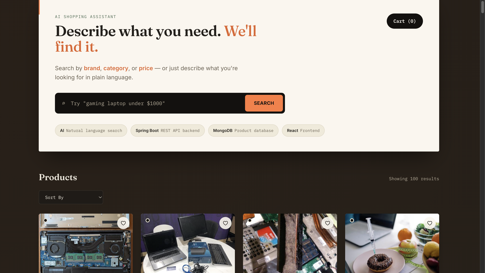
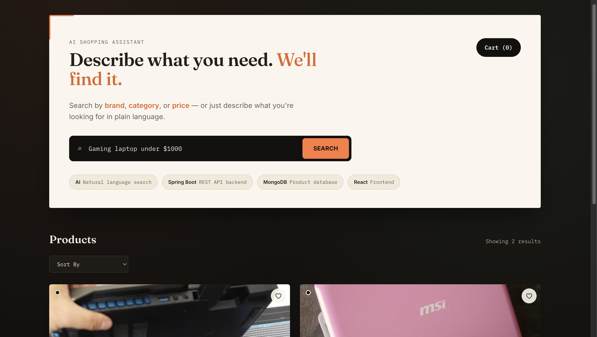
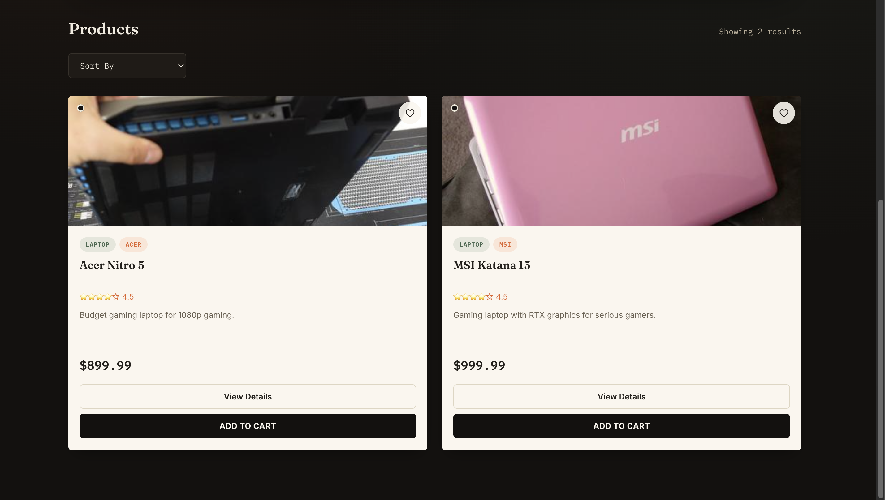
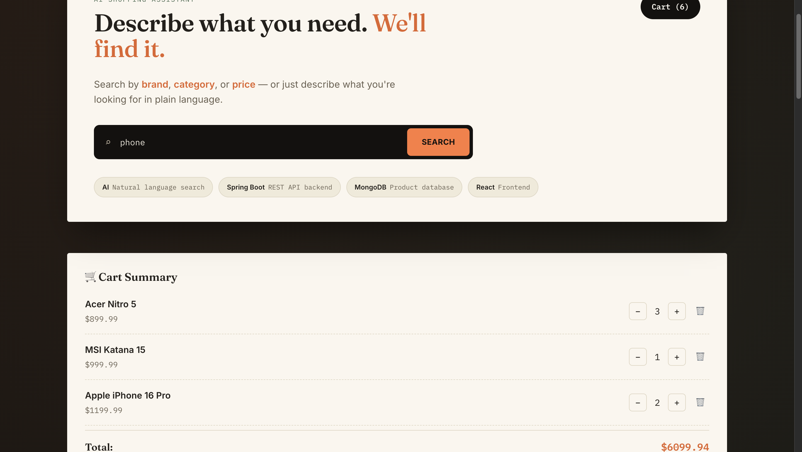
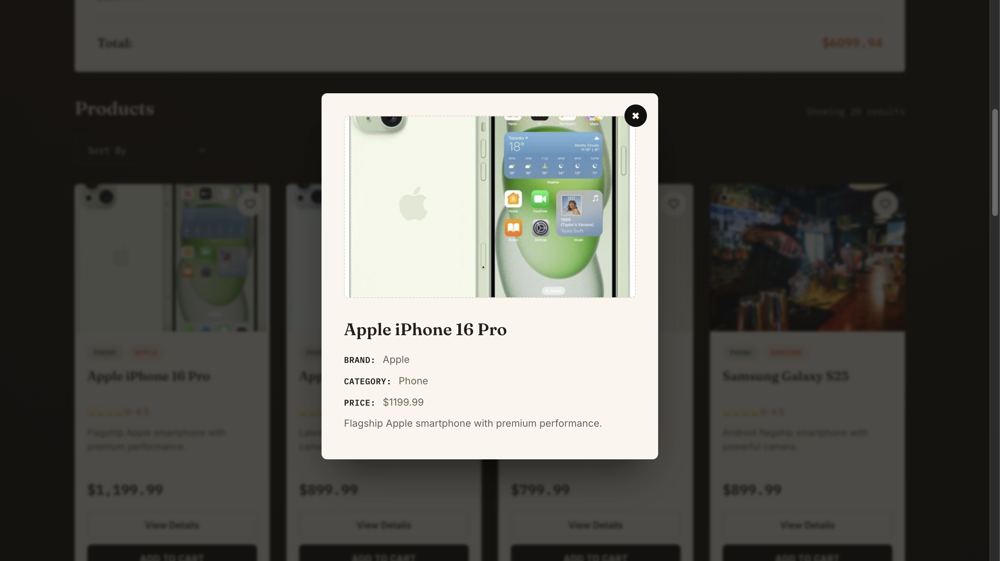

# 🤖 AI E-Commerce Assistant

An AI-powered full-stack e-commerce application that enables users to search products using natural language. Instead of traditional keyword filtering, the application leverages Groq LLM to understand user intent and return relevant products from MongoDB.

---

## 📸 Screenshots

> *(Add screenshots after deployment)*

### Home Page



### Search Results





### Shopping Cart



### Product Details



---

# ✨ Features

- 🤖 AI-powered natural language product search
- 🛒 Shopping cart with quantity management
- ❤️ Product details modal
- 📦 Automatic product loading from JSON
- 🔍 Sort products by price
- 💬 Toast notifications
- 📱 Responsive React UI
- ⚡ Fast REST APIs with Spring Boot
- 🍃 MongoDB integration
- 🔐 Secure API key using environment variables

---

# 🏗 Architecture

```
React (Frontend)
        │
        ▼
Spring Boot REST API
        │
        ▼
Groq AI (LLM)
        │
        ▼
MongoDB
```

---

# 🛠 Tech Stack

### Frontend

- React
- JavaScript
- CSS
- Vite

### Backend

- Java 21
- Spring Boot
- Spring Web
- Spring Data MongoDB

### Database

- MongoDB

### AI

- Groq API
- Llama 3.1 8B Instant

### Tools

- Git
- GitHub
- Postman
- MongoDB Compass

---

# 📂 Project Structure

```
AI-Ecommerce-Assistant
│
├── backend
│
├── frontend
│
└── screenshots
```

---

# 🚀 Getting Started

## Clone the Repository

```bash
git clone https://github.com/Venkatsaidevisetty/AI-Ecommerce-Assistant.git
```

---

## Backend

```bash
cd backend
```

Set the Groq API key:

```bash
export GROQ_API_KEY=YOUR_API_KEY
```

Run Spring Boot:

```bash
./mvnw spring-boot:run
```

---

## Frontend

```bash
cd frontend
npm install
npm run dev
```

Frontend:

```
http://localhost:5173
```

Backend:

```
http://localhost:8080
```

---

# 📦 Product Loader

The application automatically loads products from:

```
src/main/resources/products.json
```

into MongoDB during application startup.

---

# 🔒 Security

The Groq API key is **not stored** in the repository.

The application loads it from:

```
GROQ_API_KEY
```

environment variable.

---

# 🔮 Future Improvements

- Wishlist/Favorites
- User Authentication
- Order Management
- Product Reviews
- Payment Integration
- AWS S3 for Product Images
- Docker & Kubernetes Deployment

---

# 👨‍💻 Author

**Venkata Srisai Devisetty**

GitHub:

https://github.com/Venkatsaidevisetty

---

## ⭐ If you like this project

Please consider giving it a ⭐ on GitHub.
